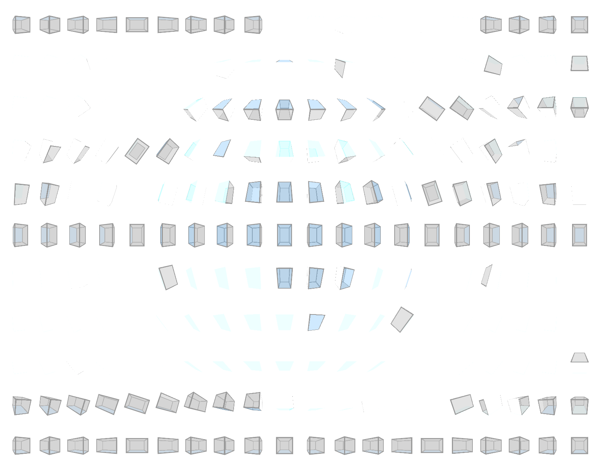

# Rectangular Rotations

Using the arrow keys will manually rotate the middle rectangle.

Demo here: http://adameivy.com/rectanglar_rotations/

## Rendered in Safari \\[^_^]/
Looks great in Safari:

## Rendered in Chrome \\[o_9]/

It appears Chrome's rendering engine pukes if you create too many 3d transformations:

